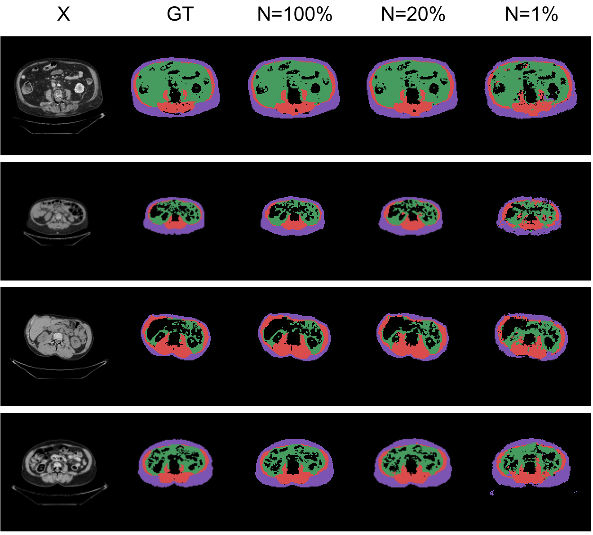
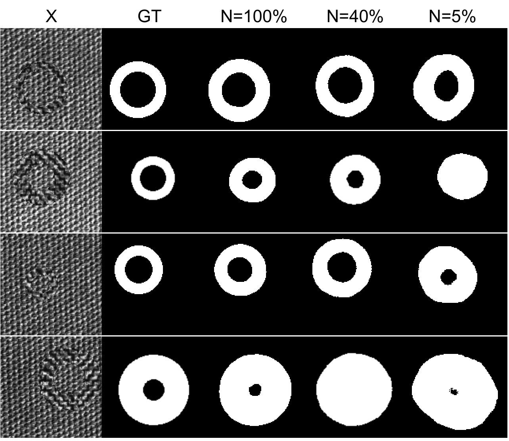

# Domain Translation via Latent Space Mapping
Implementation of the paper Domain Translation via Latent Space Mapping in PyTorch.

## Usage
Default configuration can be change in `params/` for each dataset and each models.
We provide two available implementation, one based on a classical CNN, and one based on [CycleGAN and Pix2pix implementation](https://github.com/junyanz/pytorch-CycleGAN-and-pix2pix).

The 300-W facial landmark detection dataset can be downloaded [here](https://ibug.doc.ic.ac.uk/resources/300-W/0). The model expect all the images to be preprocessed using the script in `datasets/Face/CreateFaceDataset.ipynb`.

The Toy dataset is generated using the script in `datasets/Toyset/CreateDataset.ipynb`. The used set can be found un `datasets/Toyset/toyset_128_swap/`.

The run configuration can be found in the folder `Runner`. Otherwise training and testing can be done using the mains script at the root of the project.

## Additional results

## Additional details
Part of the code is based on the [CycleGAN and Pix2pix](https://github.com/junyanz/pytorch-CycleGAN-and-pix2pix) repository.
